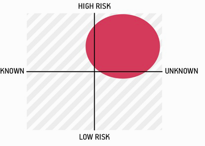

# Lean UX
## Basics
- **Design Thinking**: solve problems by using design methods
- **Agile Development + Product Design**
  1. Individuals and interaction over processes and tools &rarr; engage the entire team!
  2. Working Software over comprehensive documentation &rarr; find most viable Product according to market fit and viability
  3. Customer collaboration over contract negotiation &rarr; leads to a shared understanding
  4. Responding to change over following a fixed plan &rarr; also requires constant adjustments to fit the solution to the market
- **Minimum Viable Product**
  - Iterative approach: *build &rarr; measure &rarr; learn*
  - Reduce waste by measuring **real customer feedback**
  - Find a *hypothesis*, leading to an *MVP* which is then validated with *customer feedback*

## Principles
- **Cross Functional Team**: Diverse team made up of different roles with the goal to reduce gated handoff "waterfall" &rarr; Insight is brought from various disciplines per idea
- **Small, Dedicated, Colocated**: Small teams in one location to enhance focus, comoraderie, and to make it easier to keep current on status changed and learnings.
- **Progress = Outcomes; not Output**: Features and services are output. outcomes are the business goals they achieve.
  - If features do not perform well, a decision can be made on whether to keep going or change.
- **Problem focussed Teams**: Assign whole business problems to teams instead of small parts.
  - Produces a sense of *pride* and *ownership* and *unique solutions*
- **Remove Waste**: Only goal is improved outcomes &rarr; removed waste allows teams to be more agile and keeping focussed
- **Small Batch Size**: Avoid inventory of untested features. Waiting inhibits learning from feedback and will lead to unused or idle assets.
- **Continuous Delivery**: Engage thers throughout the process &rarr; enhance understanding *what* users do with the Product and *why* they do it.
- **Getting out of the Building (GOOB):** The answers about user needs are not solved in meething rooms.
  - Test ideas early to find out if they miss the market &rarr; customer decided in the end and earlier feedback helps you
- **Shared understanding**: More understanding inside of the team leads to less second hand reports and detailed documents being needed.
- **Anti Pattern: Rockstars and Gurus**: Team cohesion breaks down if you add individuals with big egos wanting to stand out, leading to less collaboration and shared understanding.
- **Making over Analysis**: Make ideas concrete to be able to gather feedback.
- **Learning over growth**:Do not scale unproven ideas &rarr; waste of time and resources.
- **Permission to fail**: Having safe environments leads to people trying out more experimental ideas.
  - Enhanced creativity and iterative processes lead to higher skill & knowledge
- **Get out of the deliverables Business**: Documents do not solve customer issues. Good products do.
  - Used artifacts do not matter.
  - Quality of the product measured by customer and market reaction is all that matters.

## Iterative Process
Declare Assumptions &harr; Create MVP &harr; Run an Experiment &harr; Feedback and Research ( &harr; Declare Assumption …)
## Vision Framing and Outcome
Starting point for a project is the **hypothesis**.
- **Assumption**: High level declaration of what we believe.
  - Common starting point declared as a team.
  - Reveal divergence of opinions in a team.
  - Broad set of possible solutions.
- **Hypothesis**: Granular description of *assumptions* in specific areas of the product or workflow.
- **Outcomes**: Signal we seek from the market to (in)validate the *hypothesis* - either *qualitative* or *quantitative*.
  - Need to be defined and voted on
- **Personas**: Models of the people we believe we are solving a problem for.
  - Proto Personas
    1. Sketch + Name
    2. Behavioural demographic information
    3. Pain Points & needs
    4. Potential Solutions
- **Features**: Changes or improvements driving the outcome we seek.
  - Which features are needed to achieve the desired outcomes. Serves business, customers and users first
  - Brainstorm &rarr; Cluster into themes
  - Hypothesis creation table:
  
    | We will (create) | For | In order to achieve  |
    | ------------- | ------------- | ------- |
    | [Feature]      | [Persona]      | [Outcome] |
    
  - One feature drives more than one outcome &rarr; split hypotheses into 1 statement with exactly one outcome.

## Assumptions
### Declaring Assumptions
- Gather the team and eventually customer representatives
- Bring detailed analyses and reports
### Problem Statements
- Focus of the team and constraints will be defined
  1. Current goals
  2. Problems to be addressed
  3. Explicit requests for improvement, not dictating the solution!)

### Formulate Assumptions
1. **Business Assumption**:
  - I believe my customers have a need to …
  - Need can be solved by/with …
  - Initial customers will be …
  - The prime value a customer wants to get out of the service is …
  - Customer can get additional benefits …
  - I will acquire the majority of my customers through …
  - I will make money by …
  - My primary competition in the market will be …
  - We will beat them due to …
  - My biggest product risk is …
  - We will solve this through …
  - What other assumptions do we have that might cause our business/project to fail? …
2. **User Assumption**:
  - Who is the user
  - Where does the product fit in his work(flow)
  - What problems does the product solve?
  - When and how is the product used?
  - What features are important?
  - How should our product look and behave?

### Assumptions worksheet:
Can be used to facilitate *assumption* discussion. Answer questions as a team or simply discuss them (see *Formulate Assumptions*) in a group setting. The problem statement needs to be dissected into core assumptions.
|**Business Assumptions**|**User Assumption**|
|------------------------|-----------------|
| … | … |
### Prioritize & Hypothesis Generation
Assumptions help identifying project risk. All assumptions should be recorded in a backlog to pull from if needed and need to be prioritized by risk. &rarr; Riskiest or unknown issues should be worked on first.

### Hypotheses
Each assumption, in turn, is transformed into a **hypothesis** to test them.

Parts of the Hypothesis:
1. Expectation
2. Positive/negative case
3. Required Marked Feedback

E.g.:
`We believe [true statement]. We will know we're [right | wrong] with the following market feedback: [qualitative | quantitative | KPI change]`

Those statements provide two things. A thing you expect and information on how you can verify it.

If needed *hypotheses* can be broken down into smaller parts to make them testable with one test.

**Subhypotheses** consist of:
1. **Expectation Statement** - Feature/Improvement considered making
2. **Affected User(s)** - Which of the target customers profit from the feature
3. **Outcome** - Customer benefit from the feature
4. **Required Marked feedback** - Determine whether the hypothesis is true

Sample text:
-  We believe `1) [doing this/building this feature/creating this experience]`
for ` 2) [persona/ people]` will achieve `3) [outcome]`.
  We will know this is true when we see `4) [qualitative/quantitative/market feedback]`.
